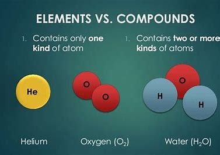

# Ch 1 Some Basic Concepts of Chemistry

## Table of Contents

- [Ch-1 Some Basic Concepts of Chemistry](ch-1-some-Basic-Concepts-of-Chemistry)
  - [Matter](matter)
    - [States of Matter](states-of-matter)
    - [Classification of matter](classification-of-matter)

## Matter

Matter: Anything which has mass and occupies space is called matter.

### States of Matter

- Solid : solids in an orderly fashion and there is not
much freedom of movement.

- Liquid: the particles are close to each other but they can
move around
- Gas:  the particles
are far apart as compared to those present in
solid or liquid states and their movement is
easy and fast.

Solid | Liquid | Gas
--|--|--
Solid have definite shape and volume| Liquid have definite volume but no shape| Gas neither have definite shape and nor volume

### Classification of matter

- Pure Substances:  all constituent particles of a
substance are same in chemical nature, it
is said to be a pure substance.

- Mixtures : A mixture contains particles of two or
more pure substances which may be present
in it in any ratio.

  - Homogeneous mixtures: Components mixed completely together.
  - Heterogeneous mixtures: the composition   is not uniform throughout
  and sometimes different components are
  visible

## Pure Substance

Pure substances have characteristics
different from mixtures. Constituent particles
of pure substances have fixed composition.

### Element vs compounds

Elements| Compounds
---|--
Elements are substances that are pure in their nature and are composed of a single atom.| Compounds are also pure substances that are composed of elements in definite proportions.
Till now 118 elements have been discovered out of which 94 elements are naturally occurring on Earth.|Infinite number of compounds can be formed. There is no absolute number.
| Elements can be categorized as metals, metalloid, and nonmetals. | Compounds are divided into three categories:Metallic, ionic, and molecular.
Elements are the single atoms. Hence they cannot be broken down. | Compounds can be broken down using chemical reactions.
They are represented using numbers and symbols. | They are represented using chemical formulas.
