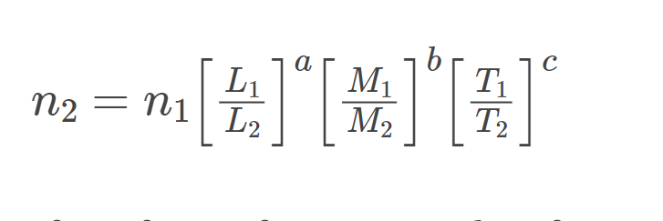

# Chapter 1 Unit and Measurements

## Table of Contents

- [Chapter 1 Unit and Measurements](#chapter-1-unit-and-measurements)
  - [Table of Contents](#table-of-contents)
  - [Units](#units)
  - [Types of Units](#types-of-units)
    - [There are 7 Fundamental Unit](#there-are-7-fundamental-unit)
    - [System of units](#system-of-units)
    - [Supplementary  Quantities](#supplementary--quantities)
  - [Significant Figures](#significant-figures)
    - [Rules for Significant Figures](#rules-for-significant-figures)
  - [Dimensions](#dimensions)
    - [Law of Homogeneity of Dimensions](#law-of-homogeneity-of-dimensions)
    - [Application of Dimension](#application-of-dimension)

## Units

**Units**: are the accepted reference, It is words and symbols for representing physical quantity

## Types of Units

**Fundamental Unit**: Unit for the base quantities are called fundamental or base units These are not derived from any Units

### There are 7 Fundamental Unit

| Base Quantity | SI Unit | |
| -------- | ------- | ---|
|           |Name | symbols|
|           Length| metre| `m`|
| Mass| kilogram| `kg`|
| Time | Second | `s`|
| Electric| Ampere| `A`|
|Temperature| Kelvin| `K`|
|Amount of Substance| mole|`mol`|
|Luminous Intensity| candela | `cd`|

**Derived Units**: The unit of all Other Quantities can be expressed as combination of the base units it is derived from fundamental unit

### System of units

- `MKS: metre, kilogram, second`
- `FPS: foot, pound, second`
- `CGS: centimetre , gram, second`

### Supplementary  Quantities

- Plane Angle, and
- Solid Angle


## Significant Figures

**Definition**: The Reliable Digits plus the first uncertain digit are known as significant figures Significant figures are used to round a number to the level of importance in the details that is most useful.

### Rules for Significant Figures

- All non-zero digits are significant.
- Zeroes between non-zero digits are significant.
- A trailing zero or final zero in the decimal portion only are significant.

```sh
 The calculator answer is 2,085.5688, but we need to round it to five significant figures. Because the first digit to be dropped (in the tenths place) is greater than 5, we round up to 2,085.6.
```

## Dimensions

The **dimensions** of a physical quantity are the
**powers** (or exponents) to which the base
quantities are raised to represent that
quantity.

| Base of Unit | Dimension |
| --| --|
| Length| `[L]`
| Mass |`[M]`
| Time | `[T]`
| Temperature | `[K]`
| Electricity | `[A]`
|Luminous Intensity|`[mol]`
| Luminous Intensity| `[cd]`

**Dimensional Formula**: The dimensions
of a physical quantity is called the dimensional
formula of the given physical quantity

 For example, the dimensional
equations of volume [V], speed [v], force [F ] and
mass density [ρ] may be expressed as

[V] = $[M^0 L^3 T^0]$
[v] = $[M^0 L T–^1]$
[F] = $[M L T^–2]$
[ρ] = $[M L–^3 T^0]$

**Dimensional Constant**: The physical quantities with dimensions and a fixed value are called dimensional constants. For example, gravitational constant (G), Planck’s constant (h), universal gas constant (R), velocity of light in a vacuum (C), etc.

**Dimensionless Quantities**: Dimensionless quantities are those which do not have dimensions but have a fixed value.

- Dimensionless quantities without units: Pure numbers, π, e, sin θ, cos θ, tan θ etc.

- Dimensionless quantities with units: Angular displacement – radian, Joule’s constant – joule/calorie, etc.
  
**Dimensional Variables**:Dimensional variables are those physical quantities which have dimensions and do not have a fixed value. For example, velocity, acceleration, force, work, power, etc.

### Law of Homogeneity of Dimensions

- In any correct equation representing the relation between physical quantities, the dimensions of all the terms must be the same on both sides. Terms separated by ‘+’ or ‘–’ must have the same dimensions.
  
- A physical quantity Q has dimensions a, b and c in length (L), mass (M) and time (T), respectively, and n1 is its numerical value in a system in which the fundamental units are L1, M1 and T1 and n2 is the numerical value in another system in which the fundamental units are L2, M2 and T2, respectively, then 

### Application of Dimension
